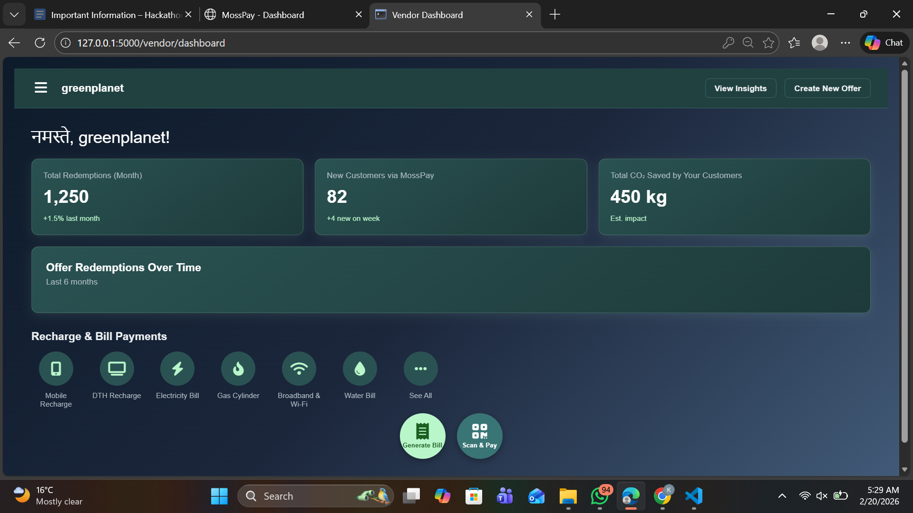
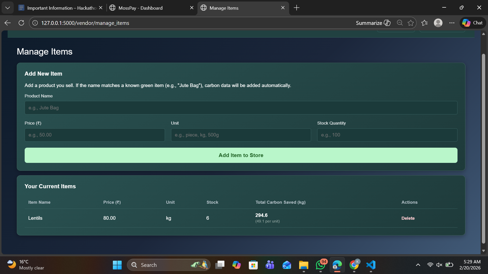
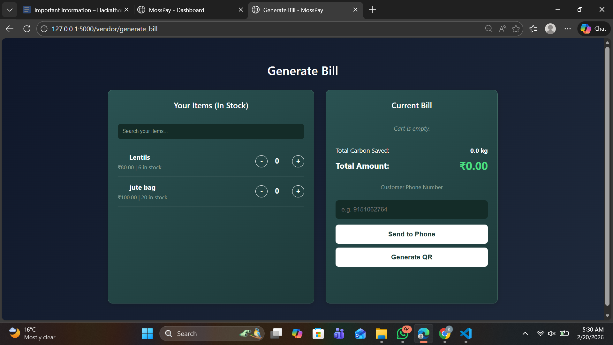

# 🌿 MossPay - Blockchain-Verified Sustainable Supply Chain & POS

**Project Description:** MossPay is a Web3-powered B2B wholesale marketplace and Universal Point-of-Sale (POS) system. It seamlessly tracks inventory, calculates real-time carbon footprint savings, computes physical logistics distances, and permanently stamps supply chain provenance onto the Algorand blockchain.

MossPay works on the concept of carbon as a currency and helps to calculate Scope 3 carbon emission data. 
It's :
TAM = 63 Million MSMEs
SAM = 20 Million Digital Vendors
SOM = 2 Million Green Vendors
---

## 🎯 Problem Statement Selected
**Supply Chain / Provenance Tracking & Carbon Credits / Sustainability Tracking.** Current supply chains lack transparency regarding their environmental impact. MossPay solves this by quantifying the carbon saved when sourcing sustainable alternatives (e.g., Jute vs. Plastic) and immutably recording both the transaction and the physical transportation distance on the Algorand blockchain. 

---

## 🔗 Submission Links (MANDATORY)
* **Live Demo URL:** `[INSERT_YOUR_HOSTED_URL_HERE]`
* **LinkedIn Demo Video URL:** `[INSERT_YOUR_LINKEDIN_VIDEO_URL_HERE]`
* **App ID (TestNet):** `755790958`
* **TestNet Explorer Link:** [View Smart Contract on Pera Explorer](https://testnet.explorer.perawallet.app/application/755790958/)

---

## 🏗️ Architecture Overview — Smart Contract + Frontend Interaction
MossPay uses a hybrid Web2/Web3 architecture designed to provide a smooth UX that hides blockchain complexity from the end user.
1. **Frontend:** A responsive HTML/CSS/JS dashboard where vendors manage inventory, buy wholesale, and process POS sales.
2. **Backend Engine:** A Python Flask server that handles inventory math, calculates real-time carbon impacts, and uses `geopy` to calculate the physical logistics distance between the buyer and seller.
3. **Smart Contract Interaction:** When a B2B or B2C transaction occurs, the Flask backend utilizes the `py-algorand-sdk` to interface with the Algorand TestNet. The exact trade details, physical distance traveled, and carbon kilograms saved are embedded into the transaction note and sent as a "Zero-Cost Data Stamp" to our AlgoKit-deployed Smart Contract. This ensures immutable, transparent provenance.

---

## 💻 Tech Stack
* **Development Framework:** AlgoKit
* **Smart Contract Language:** Python (Algorand Python / PyTEAL)
* **Web3 SDK:** `py-algorand-sdk`
* **Backend:** Python 3, Flask, SQLite, SQLAlchemy, Flask-Login
* **Frontend:** HTML5, CSS3, Vanilla JavaScript, Jinja2 Templates
* **Logistics API:** Geopy (Nominatim OpenStreetMap)

---

## ⚙️ Installation & Setup Instructions

To run this project locally on your machine:

1. **Clone the repository:**
   ```bash
   git clone [INSERT_YOUR_GITHUB_REPO_URL]
   cd mosspay-project
Create and activate a virtual environment:

Bash
python -m venv venv
# On Windows:
venv\Scripts\activate
# On Mac/Linux:
source venv/bin/activate
Install dependencies:

Bash
pip install -r requirements.txt
Run the application:

Bash
python app.py
Note: The application will automatically generate a fresh mosspay.db SQLite database upon first run.

Access the web app:
Open your browser and navigate to http://127.0.0.1:5000

## 📖 Usage Guide & Application Flow

**1. Vendor Dashboard & Analytics**
Vendors have access to a comprehensive dashboard tracking real-time metrics, including total CO2 saved by their customers, new customer acquisition, and overall redemptions.


**2. Manage Inventory (The Carbon Engine)**
Vendors can add sustainable items to their shop. The system's internal Carbon Engine automatically calculates the total potential carbon impact dynamically based on the baseline savings of the material (e.g., Jute) multiplied by the current stock.


**3. Universal POS (Generate Bill)**
A streamlined Point-of-Sale interface. Vendors can quickly adjust cart quantities using the +/- controls. Entering a customer's phone number executes a B2C sale, while entering another vendor's number triggers an instant B2B wholesale inventory transfer.


**4. Consumer Gamification Dashboard**
Consumers get a beautifully gamified experience showing their total MossCoin balance, city-wide eco-ranking, and their "Green Sprout" tree-planting progress based on the exact kilograms of CO2 they've saved by shopping sustainably.
![Consumer Dashboard] (static/images/customer_dashboard.png)

Team Members and Roles
1. Kanishka Rathore - Full Stack & Web3 Developer 
2. Soham Vikas Sharma - Frontend & BDE
3. Srashti sikarwar - Backend
4. Nandini Gupta - Database